图像融合实验
------------

> 实验选择的融合方法是HIS融合

IHS融合方法首先将多光谱图像融合从原始空间变换到HIS控件，以获得强度（Intensity，即I分量），色度（Hue，即H分量），饱和度（Saturation，即S分量）。通常图像的这三个分量相关度比较低，因此可单独对这三个通道中的某个通道进行操作。对于RGB图像，I分量的计算公式为：
　　　　　　　　　　　　　　　　　　　　　　　　　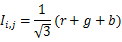

其中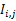针对像素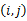为图像某个像素的红绿蓝分量。

在得到原始RGB图像的I分量之后，可以先对I分量计算出均值和方差，然后对高分辨率图像进行缩放以匹配RGB图像的均值方差。设RGB图像I分量均值方差分别为：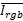，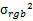，高分辨率图像的均值方差为：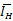，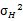为高分辨率图像的强度分量，则最终用于反变换I分量为：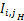
　　　　　　　　　　　　　　　　　　　　　　　　　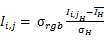
将得到的I分量与原RGB图像的H分量与S分量做反变换，可得到融合之后的RGB图像。

示例代码如下：

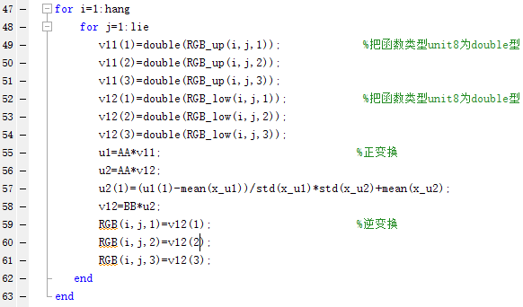

最终融合效果见图3，图1和图2为融合前的RGB图和高分辨率灰度图。

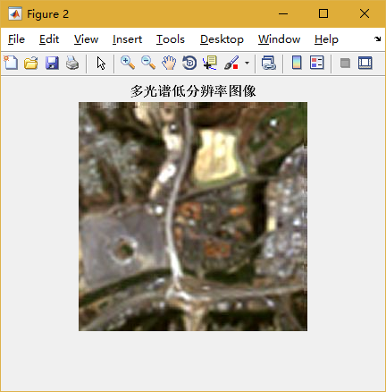
图 1 RGB图像
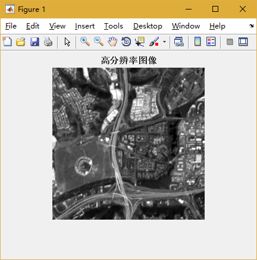
图 2 高分辨率灰度图
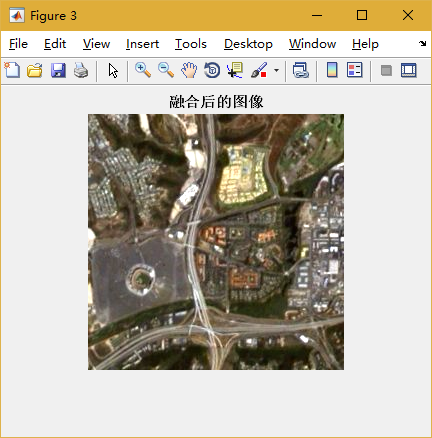
图 3 融合后的图像
证据推理实验
------------

Dempster组合规则（Dempster’s rule of combination）也称证据组合公式，其定义为：对于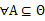上的两个mass函数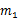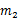
组合规则为：

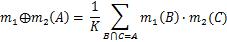
其中K为归一化常数：
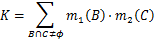

假设在2001年美国发生“
911事件”之前，布什总统分别接到美国中央情报局（CIA）和国家安全局（NSA）两大情报机构发来的绝密情报，其内容是关于中东地区的某些国家或组织企图对美国实施突然的恐怖袭击。CIA和NSA得到的证据如表1所示。试计算并回答下列问题：
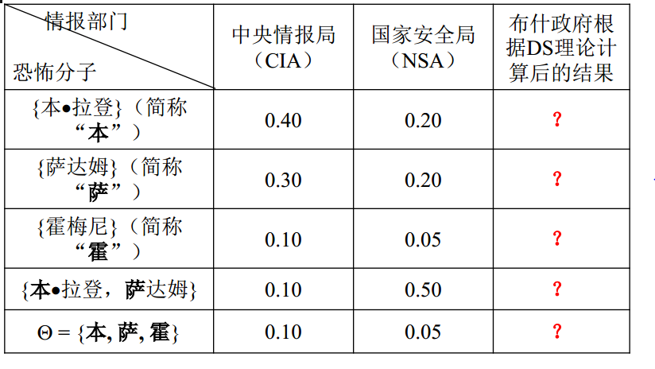

（1）请直接利用Dempster证据合成公式计算表1中的所有“？”内容

{width="5.768055555555556in"
height="3.247916666666667in"}

图 4 美国CIA和NSA所掌握的证据

根据上述表格以及上述公式，编写如下python代码：

{width="5.768055555555556in"
height="4.427083333333333in"}

按照表格将参数传入函数DST(A，B)中，参见如下代码：

{width="5.768055555555556in"
height="1.1590277777777778in"}

最终输出结果如图：

{width="5.21875in" height="1.1458333333333333in"}

图 5 最终输出结果

卡尔曼滤波
----------

> 设高度的测量误差是均值为0、方差为1的高斯白噪声随机序列，该物体的初始高度和速度
> 也是高斯分布的随机变量，且。试求该物体高度和速度随时间变化的最优估计。（）

  ------------ -------- -------- -------- -------- -------- -------- --------
  时间\[s\]    1        2        3        4        5        6        7
  高度\[km\]   1.9945   1.9794   1.9554   1.9214   1.8777   1.8250   1.7598
  时间\[s\]    8        9        10       11       12       13       14
  高度\[km\]   1.6867   1.6036   1.5092   1.4076   1.2944   1.1724   1.0399
  时间\[s\]    15       16       17       18       19       20       
  高度\[km\]   0.8980   0.7455   0.5850   0.4125   0.2318   0.0399   
  ------------ -------- -------- -------- -------- -------- -------- --------

首先选择状态变量，显然，选择速度和高度作为系统的状态变量比较简单。$kv_{k},h_{k}$，$x = \left\lbrack v,h \right\rbrack^{T}$则可得到系统状态转移方程：

$$v_{k + 1} = v_{k} + gt$$

$$h_{k + 1} = h_{k} - v_{k}t - \frac{1}{2}g{t}^{2}$$

$$x_{k + 1} = \begin{bmatrix}
1 & 0 \\
 - 1 & 1 \\
\end{bmatrix}x_{k} + \begin{bmatrix}
1 \\
 - \frac{1}{2} \\
\end{bmatrix}gt$$

其中$t,t = 1$，记$\ z_{k} = {\begin{bmatrix}
0 & 1 \\
\end{bmatrix}h}_{k} + \varepsilon_{k}k,\varepsilon_{k}$。由于$Q_{k}$不易确定，不妨假设系统方程是精确的，即不考虑空气阻力，离散化带来的误差等，根据EKF公式，此时：

$$Q_{k} = 0$$

$$A\left( k,k - 1 \right) = \begin{bmatrix}
1 & 0 \\
 - 1 & 1 \\
\end{bmatrix}$$

$$H_{k} = \left\lbrack 0\ 1 \right\rbrack$$

假设每次高度测量的方差是一定的，并且量测的服从均值为0的正态分布。也即：

$R_{k} = \ $\[1\]

系统初始化时有

$$x_{0} = \begin{bmatrix}
10 \\
1900 \\
\end{bmatrix}$$

$$P_{0} = \begin{bmatrix}
100 & 0 \\
0 & 2 \\
\end{bmatrix}$$

根据EKF公式：

{width="5.768055555555556in"
height="3.3020833333333335in"}

则Python代码如下：

{width="5.768055555555556in"
height="4.497222222222222in"}

图 6 卡尔曼估计的Python代码

最终估计效果如图7所示：

图 7

卡尔曼滤波的最优准则是估计误差的协方差阵最小，但是这个最优只在所有噪声都是零均值高斯白噪声下能实现。系统为非线性，系统中存在非零均值噪声，或者噪声之间是相关的等情况都会影响其最优性。另外卡尔曼滤波总的来说分两步，先验和修正，其中第二步是用量测去修正先验估计，最终结果肯定是估计在量测附近，图7中估计的高度先是上升的，就是因量测比先验估计大的缘故。

假设检验
--------

1.  某电子元器件寿命服从正态分布$X\sim N(\mu,40^{2})$，从某批产品中抽取9个样本，计算得$\overset{\overline{}}{X} = \ 780$。

问：能否认为此批产品的平均寿命为800？（显著性水平为0.05）

**解**：该问题属于方差已知时单个正态总体均值的U检验，在matlab下输入以下代码：

> {width="4.510416666666667in"
> height="0.3229166666666667in"}

运行结果为0，因此可以认为其均值为800.

1.  某电子元器件寿命服从正态分布$X\sim N\left( \mu,100^{2} \right),$现抽取25个样本，测算其平均寿命为950。

问：能否认为其平均使用寿命不低于1000？（显著性水平为0.05）

**解**：该问题属于方差未知时单个正态总体均值的t检验。

由于：

$$\frac{\overset{\overline{}}{X} - \mu}{\sigma}\sim N(0,1)$$

显著性水平0.05下的$\overset{\overline{}}{X}$范围为：（835，1164.5）。$950 \in (835,1164.5)$。

因此可以认为其平均使用寿命不低于1000。

1.  某电子元器件寿命服从正态分布现抽取25个样本，测算其平均寿命为950，标准差为100。

问：能否认为其平均使用寿命不低于1000？（显著性水平为0.01）

**解：**由于：

$$\frac{\overset{\overline{}}{X} - \mu}{S}\sim t(24)$$

假设平均寿命1000，显著性水平0.01下的$\overset{\overline{}}{X}$范围为：（835，1164.5）。$950 \in (751,1249.0)$，因此可以认为其平均寿命不低于1000.
